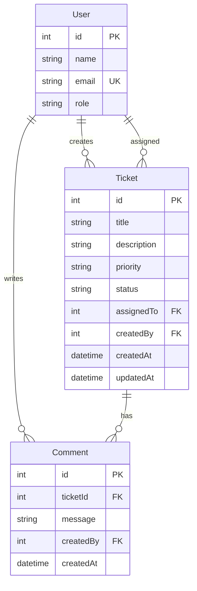

# Data Model

**Version:** 0.1 (Draft)

## Entity Relationship

---

## User

Seeded only — no application CRUD in Core.

| Column | Type | Constraints | Notes |
|--------|------|-------------|-------|
| id | INTEGER | PK, autoincrement | |
| name | VARCHAR(100) | NOT NULL | Display name |
| email | VARCHAR(255) | NOT NULL, UNIQUE | |
| role | VARCHAR(50) | NOT NULL | `Agent`, `Admin` |

---

## Ticket

| Column | Type | Constraints | Notes |
|--------|------|-------------|-------|
| id | INTEGER | PK, autoincrement | |
| title | VARCHAR(200) | NOT NULL | |
| description | TEXT | NOT NULL | |
| priority | VARCHAR(20) | NOT NULL | Enum: Low, Medium, High |
| status | VARCHAR(20) | NOT NULL, default `Open` | State machine |
| assigned_to | INTEGER | FK → users.id, NULLABLE | Maps to API `assignedTo` |
| created_by | INTEGER | FK → users.id, NOT NULL | Maps to API `createdBy` |
| created_at | DATETIME | NOT NULL | UTC, server default |
| updated_at | DATETIME | NOT NULL | UTC, on update |

### Indexes (planned)

- `status`
- `priority`
- `created_by`
- `assigned_to`

---

## Comment

| Column | Type | Constraints | Notes |
|--------|------|-------------|-------|
| id | INTEGER | PK, autoincrement | |
| ticket_id | INTEGER | FK → tickets.id, NOT NULL, ON DELETE CASCADE | Maps to API `ticketId` |
| message | TEXT | NOT NULL | Max 2000 chars (app validation) |
| created_by | INTEGER | FK → users.id, NOT NULL | |
| created_at | DATETIME | NOT NULL | UTC, server default |

---

## API ↔ Database Naming

| API (camelCase) | DB (snake_case) |
|-----------------|-----------------|
| assignedTo | assigned_to |
| createdBy | created_by |
| createdAt | created_at |
| updatedAt | updated_at |
| ticketId | ticket_id |

Pydantic schemas use `alias` or `model_config` for serialization.

---

## Seed Data (Planned)

See `database/seed-data/users.json` for initial users.

---

## Implementation Status

Models and migrations not yet implemented. See [implementation-plan.md](./implementation-plan.md) M1.
