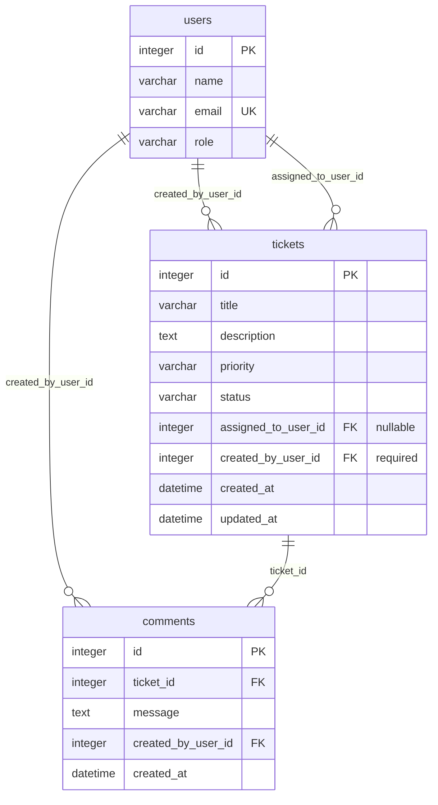

# Data Model

**Version:** 1.1  
**Last Updated:** 2026-07-20  
**Status:** Implemented — matches `alembic/versions/001_initial.py`

---

## 1. Overview

Three tables: `users`, `tickets`, `comments`. SQLite database at `data/tickets.db`. Managed by Alembic in `src/backend/alembic/versions/`.

---

## 2. Entity Relationship Diagram

---

## 3. Enumerations

Enforced in Pydantic schemas and application services.

### TicketPriority

`Low` | `Medium` | `High` | `Critical`

### TicketStatus

| Value | Notes |
|-------|-------|
| `Open` | Default on create |
| `In Progress` | |
| `Resolved` | |
| `Closed` | Terminal |
| `Cancelled` | Terminal |

### UserRole

`Agent` | `Admin` (informational in Core)

---

## 4. Table: `users`

Seeded only — no CRUD API in Core.

| Column | Type | Constraints |
|--------|------|-------------|
| `id` | INTEGER | PK, autoincrement |
| `name` | VARCHAR(100) | NOT NULL |
| `email` | VARCHAR(255) | NOT NULL, UNIQUE |
| `role` | VARCHAR(50) | NOT NULL |

**Seed file:** `database/seed-data/users.json` (4 fictional users)

---

## 5. Table: `tickets`

| Column | Type | Constraints |
|--------|------|-------------|
| `id` | INTEGER | PK, autoincrement |
| `title` | VARCHAR(200) | NOT NULL |
| `description` | TEXT | NOT NULL |
| `priority` | VARCHAR(20) | NOT NULL |
| `status` | VARCHAR(20) | NOT NULL, default `Open` |
| `assigned_to_user_id` | INTEGER | FK → `users.id`, NULLABLE, indexed |
| `created_by_user_id` | INTEGER | FK → `users.id`, NOT NULL, indexed |
| `created_at` | DATETIME(tz) | NOT NULL |
| `updated_at` | DATETIME(tz) | NOT NULL |

**Business rules:**

- `status` changes only via `services/status_machine.py`
- `updated_at` set on field updates and status transitions
- Comments do not update ticket `updated_at`

---

## 6. Table: `comments`

| Column | Type | Constraints |
|--------|------|-------------|
| `id` | INTEGER | PK, autoincrement |
| `ticket_id` | INTEGER | FK → `tickets.id` ON DELETE CASCADE, indexed |
| `message` | TEXT | NOT NULL (1–2000 chars, app validation) |
| `created_by_user_id` | INTEGER | FK → `users.id`, NOT NULL |
| `created_at` | DATETIME(tz) | NOT NULL |

Returned in ticket detail ordered by `created_at` ascending.

---

## 7. API ↔ Database Mapping

| API (camelCase) | Database column |
|-----------------|-----------------|
| `assignedTo` | `assigned_to_user_id` |
| `createdBy` | `created_by_user_id` |
| `createdAt` | `created_at` |
| `updatedAt` | `updated_at` |
| `ticketId` | `ticket_id` |

Pydantic schemas use `validation_alias` for ORM deserialization and `serialization_alias` for JSON output.

---

## 8. Seed Data

| File | Contents |
|------|----------|
| `database/seed-data/users.json` | 4 fictional users |
| `database/seed-data/sample_data.json` | 6 tickets, 6 comments |

Run: `python -m app.scripts.seed` from `src/backend/`

---

## 9. SQLAlchemy Models

Located in `src/backend/app/models/`:

- `user.py` — `User`
- `ticket.py` — `Ticket`
- `comment.py` — `Comment`

---

## 10. Migration History

| Revision | File | Description |
|----------|------|-------------|
| `001_initial` | `alembic/versions/001_initial.py` | Initial schema |
