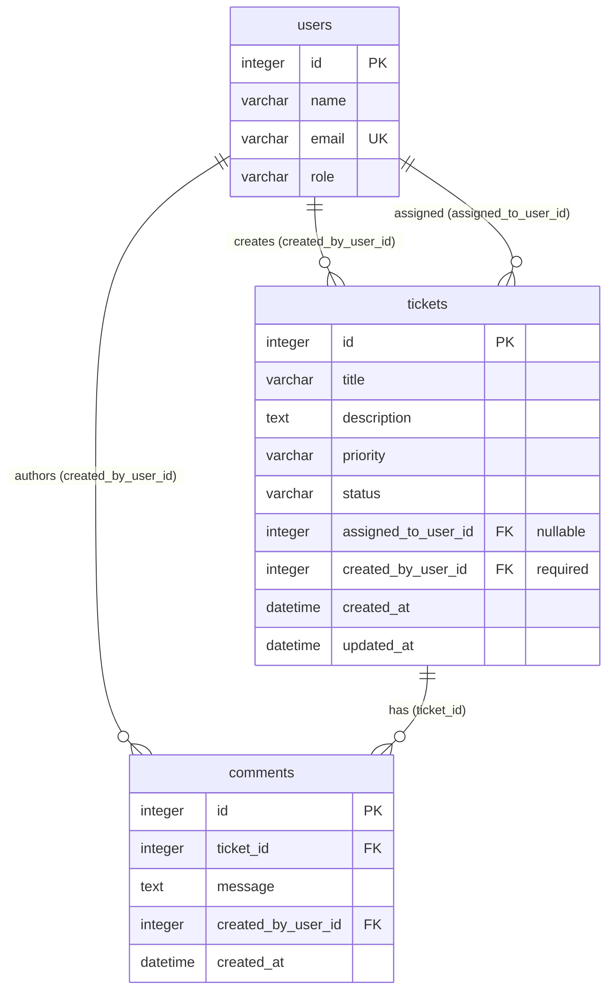

# Data Model

**Version:** 1.0  
**Last Updated:** 2026-07-20  
**Status:** Design complete — ready for M1 implementation

---

## 1. Overview

Three tables: `users`, `tickets`, `comments`. SQLite database file at `data/tickets.db` (gitignored). Schema managed by Alembic in `src/backend/alembic/versions/`.

---

## 2. Entity Relationship Diagram



---

## 3. Enumerations

Stored as `VARCHAR` in SQLite; enforced in application layer (Pydantic + SQLAlchemy `CheckConstraint` optional).

### TicketPriority

| Value |
|-------|
| `Low` |
| `Medium` |
| `High` |
| `Critical` |

### TicketStatus

| Value | Notes |
|-------|-------|
| `Open` | Default on create |
| `In Progress` | |
| `Resolved` | |
| `Closed` | Terminal |
| `Cancelled` | Terminal |

### UserRole (informational in Core)

| Value |
|-------|
| `Agent` |
| `Admin` |

---

## 4. Table: `users`

Seeded only — no application CRUD in Core.

| Column | SQL Type | Constraints | Description |
|--------|----------|-------------|-------------|
| `id` | INTEGER | PRIMARY KEY AUTOINCREMENT | Surrogate key |
| `name` | VARCHAR(100) | NOT NULL | Display name |
| `email` | VARCHAR(255) | NOT NULL, UNIQUE | Login identifier (unused in Core) |
| `role` | VARCHAR(50) | NOT NULL | `Agent` or `Admin` |

**Indexes:** unique on `email` (automatic with UNIQUE constraint).

**Seed source:** `database/seed-data/users.json`

---

## 5. Table: `tickets`

| Column | SQL Type | Constraints | Description |
|--------|----------|-------------|-------------|
| `id` | INTEGER | PRIMARY KEY AUTOINCREMENT | |
| `title` | VARCHAR(200) | NOT NULL | Short summary |
| `description` | TEXT | NOT NULL | Full details |
| `priority` | VARCHAR(20) | NOT NULL | See TicketPriority |
| `status` | VARCHAR(20) | NOT NULL, DEFAULT `'Open'` | See TicketStatus |
| `assigned_to_user_id` | INTEGER | NULL, FK → `users.id` | Nullable assignee |
| `created_by_user_id` | INTEGER | NOT NULL, FK → `users.id` | Ticket creator |
| `created_at` | DATETIME | NOT NULL | UTC, set on insert |
| `updated_at` | DATETIME | NOT NULL | UTC, set on insert/update |

### Foreign keys

```sql
FOREIGN KEY (assigned_to_user_id) REFERENCES users(id)
FOREIGN KEY (created_by_user_id) REFERENCES users(id)
```

### Indexes

| Name | Column(s) | Purpose |
|------|-----------|---------|
| `ix_tickets_status` | `status` | Filter by status |
| `ix_tickets_priority` | `priority` | Filter by priority |
| `ix_tickets_created_by_user_id` | `created_by_user_id` | CSV export, filter |
| `ix_tickets_assigned_to_user_id` | `assigned_to_user_id` | Filter by assignee |
| `ix_tickets_updated_at` | `updated_at` | Default sort |

---

## 6. Table: `comments`

| Column | SQL Type | Constraints | Description |
|--------|----------|-------------|-------------|
| `id` | INTEGER | PRIMARY KEY AUTOINCREMENT | |
| `ticket_id` | INTEGER | NOT NULL, FK → `tickets.id` ON DELETE CASCADE | Parent ticket |
| `message` | TEXT | NOT NULL | 1–2000 chars (app validation) |
| `created_by_user_id` | INTEGER | NOT NULL, FK → `users.id` | Comment author |
| `created_at` | DATETIME | NOT NULL | UTC, set on insert |

### Indexes

| Name | Column(s) | Purpose |
|------|-----------|---------|
| `ix_comments_ticket_id` | `ticket_id` | Load comments for ticket detail |

---

## 7. SQLAlchemy Model Sketch

```python
# Naming: Python attributes use snake_case matching DB columns.
# API serialization uses Pydantic aliases for camelCase.

class User(Base):
    __tablename__ = "users"
    id: Mapped[int] = mapped_column(primary_key=True)
    name: Mapped[str] = mapped_column(String(100))
    email: Mapped[str] = mapped_column(String(255), unique=True)
    role: Mapped[str] = mapped_column(String(50))

    created_tickets: Mapped[list["Ticket"]] = relationship(
        foreign_keys="Ticket.created_by_user_id", back_populates="creator"
    )
    assigned_tickets: Mapped[list["Ticket"]] = relationship(
        foreign_keys="Ticket.assigned_to_user_id", back_populates="assignee"
    )


class Ticket(Base):
    __tablename__ = "tickets"
    # ... columns as above
    creator: Mapped["User"] = relationship(foreign_keys=[created_by_user_id])
    assignee: Mapped["User | None"] = relationship(foreign_keys=[assigned_to_user_id])
    comments: Mapped[list["Comment"]] = relationship(back_populates="ticket")


class Comment(Base):
    __tablename__ = "comments"
    ticket: Mapped["Ticket"] = relationship(back_populates="comments")
    author: Mapped["User"] = relationship()
```

---

## 8. API ↔ Database Field Mapping

| API (JSON camelCase) | Database column |
|----------------------|-----------------|
| `id` | `id` |
| `title` | `title` |
| `description` | `description` |
| `priority` | `priority` |
| `status` | `status` |
| `assignedTo` | `assigned_to_user_id` |
| `createdBy` | `created_by_user_id` |
| `createdAt` | `created_at` |
| `updatedAt` | `updated_at` |
| `ticketId` | `ticket_id` |

Pydantic v2 config:

```python
model_config = ConfigDict(from_attributes=True, populate_by_name=True)
# Field aliases: assignedTo = Field(alias="assignedTo", serialization_alias="assignedTo")
```

---

## 9. Timestamp Rules

| Event | `created_at` | `updated_at` |
|-------|--------------|--------------|
| Ticket create | Set to `now(UTC)` | Set to `now(UTC)` |
| Ticket field update | Unchanged | Set to `now(UTC)` |
| Status transition | Unchanged | Set to `now(UTC)` |
| Comment create | Set to `now(UTC)` | N/A |

Use `datetime.now(timezone.utc)` in services; store as naive UTC or timezone-aware per SQLAlchemy config (recommend timezone-aware).

---

## 10. Migration Plan

| Revision | Description |
|----------|-------------|
| `001_initial` | Create `users`, `tickets`, `comments` with FKs and indexes |

Seed users run after migration via CLI script or Alembic post-hook (idempotent: skip if emails exist).

---

## 11. Data Integrity Rules (Application Layer)

| Rule | Enforced by |
|------|-------------|
| `created_by_user_id` always set on ticket create | `ticket_service.create` |
| `assigned_to_user_id` must reference existing user or be null | `ticket_service` |
| `status` only changes via state machine | `ticket_service.transition_status` |
| Comments require existing ticket | `comment_service.create` |
| No ticket/comment/user delete in Core | No delete endpoints |

---

## 12. Implementation Status

| Item | Status |
|------|--------|
| SQLAlchemy models | Not implemented (M1) |
| Alembic `001_initial` | Not implemented (M1) |
| Seed script | Not implemented (M1) |
