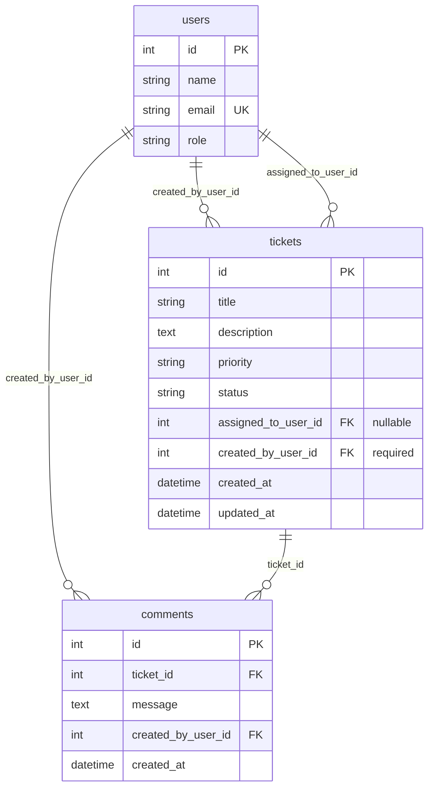

# Design Notes

**Version:** 1.0  
**Last Updated:** 2026-07-22  
**Status:** Implemented — matches `src/backend/` and `src/frontend/`

---

## 1. Architecture Overview

Simple three-tier layout: React SPA → FastAPI REST API → SQLite via SQLAlchemy.

```
┌─────────────────────────────────────────────────────────────┐
│  src/frontend/  (React + TypeScript + Vite)                 │
│  ┌─────────────┐  ┌──────────────┐  ┌────────────────────┐ │
│  │ Pages       │→ │ Components   │→ │ api/client.ts      │ │
│  │ + Context   │  │ + forms      │  │ (X-User-Id header) │ │
│  └─────────────┘  └──────────────┘  └─────────┬──────────┘ │
└───────────────────────────────────────────────┼────────────┘
                                                │ HTTP/JSON
┌───────────────────────────────────────────────▼────────────┐
│  src/backend/  (FastAPI)                                    │
│  ┌──────────┐  ┌────────────┐  ┌─────────────────────────┐ │
│  │ api/     │→ │ services/  │→ │ models/ (SQLAlchemy)    │ │
│  │ routes   │  │ status_machine│ │ + schemas/ (Pydantic)  │ │
│  └──────────┘  └────────────┘  └────────────┬────────────┘ │
└─────────────────────────────────────────────┼──────────────┘
                                              │
                                     ┌────────▼────────┐
                                     │ SQLite + Alembic │
                                     └─────────────────┘
```

**Design principle:** Keep layers thin. Routes validate HTTP and delegate; services hold business rules; models map to the database.

---

## 2. Backend Module Structure

```
src/backend/
├── app/
│   ├── main.py                 # FastAPI app, CORS, router registration
│   ├── core/
│   │   ├── config.py           # Settings from .env
│   │   ├── database.py         # Engine, SessionLocal, get_db
│   │   ├── dependencies.py     # get_acting_user (X-User-Id)
│   │   └── exceptions.py       # AppError + global exception handlers
│   ├── models/
│   │   ├── user.py
│   │   ├── ticket.py
│   │   └── comment.py
│   ├── schemas/
│   │   ├── user.py
│   │   ├── ticket.py
│   │   ├── comment.py
│   │   └── error.py            # ErrorResponse envelope
│   ├── services/
│   │   ├── status_machine.py   # Pure domain: allowed transitions
│   │   ├── ticket_service.py   # CRUD, filters, updates (no status)
│   │   ├── comment_service.py
│   │   └── csv_export.py       # Build CSV for acting user
│   └── api/
│       ├── router.py           # Aggregates sub-routers
│       ├── health.py
│       ├── users.py
│       └── tickets.py          # tickets + comments + export + status
├── alembic/
└── requirements.txt
```

### Layer responsibilities

| Layer | Responsibility | Must not |
|-------|----------------|----------|
| `api/` | HTTP mapping, status codes, call services | Contain state machine logic |
| `services/` | Business rules, orchestration, queries | Know about HTTP |
| `models/` | Table definitions, relationships | Validate request payloads |
| `schemas/` | Request/response shapes, field validation | Query the database |
| `core/dependencies.py` | Resolve acting user from header | Implement ticket logic |

### Status state machine

All transition rules live in **`services/status_machine.py`** as pure functions:

```python
def get_allowed_transitions(current: TicketStatus) -> list[TicketStatus]: ...
def validate_transition(current: TicketStatus, target: TicketStatus) -> None:  # raises AppError
```

`ticket_service.transition_status()` calls `validate_transition()` before persisting. No other module may change `ticket.status` without going through this path.

`PATCH /tickets/{id}` **rejects** any `status` field in the request body (Pydantic `model` excludes it; extra fields ignored or rejected).

---

## 3. Frontend Component Structure

```
src/frontend/src/
├── main.tsx
├── App.tsx                     # Router + providers
├── api/
│   ├── client.ts               # fetch wrapper, X-User-Id, error parsing
│   └── types.ts                # Shared TS types mirroring API
├── context/
│   └── ActingUserContext.tsx   # Selected user + setUser
├── pages/
│   ├── TicketListPage.tsx
│   ├── TicketCreatePage.tsx
│   └── TicketDetailPage.tsx
├── components/
│   ├── layout/
│   │   ├── AppHeader.tsx       # Title + ActingUserSelector + disclaimer
│   │   └── AppLayout.tsx
│   ├── users/
│   │   └── ActingUserSelector.tsx
│   ├── tickets/
│   │   ├── TicketList.tsx
│   │   ├── TicketFilters.tsx   # status, priority, assignee, search
│   │   ├── TicketForm.tsx      # create + edit fields (no status)
│   │   ├── TicketStatusActions.tsx  # buttons for allowed transitions
│   │   └── TicketExportButton.tsx
│   ├── comments/
│   │   ├── CommentList.tsx
│   │   └── CommentForm.tsx
│   └── common/
│       ├── ErrorAlert.tsx      # Renders error.message + field details
│       ├── LoadingSpinner.tsx
│       └── FieldError.tsx
└── hooks/
    ├── useTickets.ts           # list + filters
    └── useTicket.ts            # single ticket + mutations
```

### Routing

| Path | Page | Primary API calls |
|------|------|-------------------|
| `/` | TicketListPage | `GET /tickets`, `GET /users` |
| `/tickets/new` | TicketCreatePage | `POST /tickets` |
| `/tickets/:id` | TicketDetailPage | `GET /tickets/{id}`, `PATCH`, status, comments |

No global state library — React Context for acting user; page-level `useState`/`useEffect` or thin custom hooks for data fetching.

---

## 4. Database Relationships



| Relationship | Cardinality | On delete |
|--------------|-------------|-----------|
| User → Ticket (creator) | 1:N | RESTRICT |
| User → Ticket (assignee) | 1:N optional | SET NULL on user delete (seeded users — N/A in Core) |
| Ticket → Comment | 1:N | CASCADE |
| User → Comment (author) | 1:N | RESTRICT |

---

## 5. Acting-User Header (`X-User-Id`)

### Purpose

Identifies **who is performing the action**. This is acting-user context, **not authentication**.

### Backend flow

1. `get_acting_user` dependency reads `X-User-Id` header.
2. Parse as positive integer; lookup `users` table.
3. Inject `User` model into route handlers.
4. Used for: `created_by_user_id` on create, comment author, CSV export filter.

### Required on

All endpoints except `GET /health`.

### Frontend flow

1. `ActingUserContext` holds `currentUserId` and `users[]`.
2. On mount: `GET /users` (no header needed if we allow users list without acting user — **design decision: `GET /users` also requires `X-User-Id`** for consistency, OR exempt it for bootstrap).

**Bootstrap approach (chosen):** `GET /users` does **not** require `X-User-Id` so the selector can populate before a user is chosen. First load uses no header; after selection, all other calls include it. Document in API contract.

Actually re-read user requirements - they want header for acting user. For bootstrap, exempting GET /users makes UX simpler. I'll document:
- `GET /health` — no header
- `GET /users` — no header (bootstrap for selector)
- All other endpoints — header required

### Error codes

| Condition | HTTP | Code |
|-----------|------|------|
| Header missing | 401 | `MISSING_ACTING_USER` |
| Non-integer value | 401 | `INVALID_ACTING_USER` |
| User not found | 401 | `ACTING_USER_NOT_FOUND` |

---

## 6. Validation Strategy

### Backend (two layers)

1. **Pydantic schemas** — field types, lengths, enums, required fields on input.
2. **Service layer** — foreign key existence (assignee, ticket), state machine, business rules.

| Field | Rules |
|-------|-------|
| title | Required on create; 1–200 chars |
| description | Required on create; 1–5000 chars |
| priority | Enum: `Low`, `Medium`, `High`, `Critical` |
| status | Only via `PATCH .../status`; enum validated + state machine |
| assignedTo | Optional; must reference existing user if provided |
| message (comment) | Required; 1–2000 chars |

`TicketUpdate` schema explicitly **omits** `status`. If client sends `status` in PATCH body, return `422` with `VALIDATION_ERROR` and details.

### Frontend

- HTML5 `required` / `maxLength` for immediate feedback.
- On API `422`: map `error.details.fields` to form fields via `<FieldError>`.
- On other errors: show `error.message` in `<ErrorAlert>`.

---

## 7. Error-Handling Strategy

### Standard error envelope (all API errors)

```json
{
  "error": {
    "code": "ERROR_CODE",
    "message": "Readable error message",
    "details": {}
  }
}
```

### `details` shapes

| Code | details example |
|------|-----------------|
| `VALIDATION_ERROR` | `{ "fields": { "title": "Field required" } }` |
| `INVALID_STATUS_TRANSITION` | `{ "currentStatus": "Open", "requestedStatus": "Resolved" }` |
| `NOT_FOUND` | `{ "resource": "ticket", "id": 99 }` |

### Backend implementation

- Custom `AppError(code, message, details, status_code)` raised in services.
- `@app.exception_handler(AppError)` → JSON envelope.
- `@app.exception_handler(RequestValidationError)` → map to `VALIDATION_ERROR`.
- Catch-all `500` → `INTERNAL_ERROR` without leaking stack traces.

### Frontend implementation

- `api/client.ts`: if `!response.ok`, parse `error` object and throw `ApiError`.
- Components catch `ApiError` and render via `<ErrorAlert>` or field mapping.
- Network failures: generic message, no parse attempt.

---

## 8. Search and Filter Behavior

`GET /tickets` supports query parameters combined with **AND** logic:

| Param | Match |
|-------|-------|
| `status` | Exact match |
| `priority` | Exact match |
| `assignedTo` | Exact user ID; use `unassigned=true` for null assignee |
| `createdBy` | Exact user ID (optional filter, not scoped to acting user) |
| `q` | Case-insensitive substring in **title OR description** |

- Sort: `updatedAt` descending (most recently updated first).
- No pagination in Core — return full result set.
- Empty result: `200` with `[]`.

---

## 9. CSV Export Behavior

**Endpoint:** `GET /tickets/export`

| Aspect | Behavior |
|--------|----------|
| Scope | Tickets where `created_by_user_id` = acting user (`X-User-Id`) |
| Format | RFC 4180 CSV, UTF-8 |
| Content-Type | `text/csv; charset=utf-8` |
| Filename | `my-tickets-{userId}-{YYYYMMDD}.csv` |
| Empty set | Header row only |
| Columns | id, title, description, priority, status, assignedTo, createdBy, createdAt, updatedAt |
| Escaping | Python `csv` module (quotes fields with commas/newlines) |

Implemented in `services/csv_export.py`; route returns `StreamingResponse` or `Response` with bytes.

---

## 10. Status State Machine

```
Open ──────────► In Progress ──► Resolved ──► Closed
  │                    │
  └──── Cancelled ◄────┘
```

| From | Allowed targets |
|------|-----------------|
| Open | In Progress, Cancelled |
| In Progress | Resolved, Cancelled |
| Resolved | Closed |
| Closed | *(none — terminal)* |
| Cancelled | *(none — terminal)* |

Invalid transitions → `422` + `INVALID_STATUS_TRANSITION`.

---

## 11. Test Layers

| Layer | Location | Tool | What to test |
|-------|----------|------|--------------|
| Domain unit | `tests/backend/` | Pytest | `status_machine`, `csv_export` |
| API unit | `tests/backend/` | Pytest + TestClient | Each endpoint, error envelope |
| Integration | `tests/integration/` | Pytest + TestClient + DB | Full status transition matrix |
| Component | `src/frontend/src/` | Vitest + RTL | Selector, forms, errors, list |
| Manual | checklist | — | Persistence after restart, CSV download |

See [test-strategy.md](./test-strategy.md) for case inventory.

---

## 12. Architecture Trade-offs

| Choice | Benefit | Cost | Why acceptable for Core |
|--------|---------|------|------------------------|
| SQLite file DB | Zero infra, persists across restart | Poor concurrent write scaling | Single-user demo; hundreds of tickets |
| `X-User-Id` header vs JWT | Trivial to implement and test | Not secure | Explicitly out of scope for auth |
| No pagination | Simpler API and UI | Slow list at scale | NFR targets hundreds, not millions |
| Dedicated status endpoint | Clear separation, easy to test | Extra HTTP call | Prevents accidental status bypass |
| Pure function state machine | 100% unit testable, no DB needed | Small extra module | Minimal complexity |
| React Context vs Redux | Fewer dependencies | Doesn't scale to huge apps | Three pages, one global concern |
| camelCase API / snake_case DB | JS idiomatic + SQL idiomatic | Mapping in Pydantic | Standard practice |
| `GET /users` without header | Selector works on first paint | Slight inconsistency | Pragmatic bootstrap UX |
| Service layer vs fat routes | Testable business logic | More files | Still small total codebase |
| No comment edit/delete | Smaller scope | Less feature-complete | Per requirements |

---

## 13. Resolved Design Questions

| Question | Resolution |
|----------|------------|
| Assignee nullable? | Yes — `assigned_to_user_id` NULL |
| Priority values | Low, Medium, High, **Critical** |
| Status update path | Only `PATCH /tickets/{id}/status` |
| Search scope | Title + description, case-insensitive |
| Pagination | Stretch; not in Core |
| Closed terminal? | Yes |
| CSV timezone | ISO 8601 UTC |
| Who can update tickets? | Any seeded user (Core) |

---

## 14. Related Documents

| Document | Content |
|----------|---------|
| [data-model.md](./data-model.md) | Table definitions, indexes, enums |
| [api-contract.md](./api-contract.md) | Full endpoint specification |
| [ui-flow.md](./ui-flow.md) | User journeys and wire-level UI |
| [test-strategy.md](./test-strategy.md) | Test cases and fixtures |
| [requirements-analysis.md](./requirements-analysis.md) | Original requirements |
| [implementation-plan.md](./implementation-plan.md) | Build milestones |
