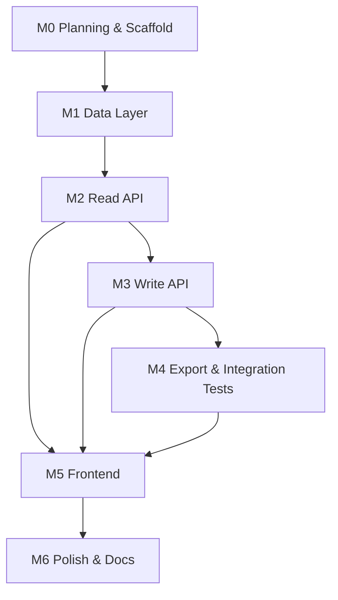

# Implementation Plan

## Support Ticket Management System

**Version:** 0.1 (Planning)  
**Last Updated:** 2026-07-18

---

## 1. Goals

Deliver a working Core application that satisfies all acceptance criteria in [acceptance-criteria.md](./acceptance-criteria.md), with clean architecture suitable for AI-assisted iteration and human code review.

**Explicit non-goals for initial delivery:** authentication, role enforcement, stretch features.

---

## 2. Architecture Summary

```
┌─────────────────┐     X-User-Id      ┌─────────────────┐
│  React + Vite   │ ─────────────────► │    FastAPI      │
│  (frontend)     │     JSON/REST      │    (backend)    │
└─────────────────┘                    └────────┬────────┘
                                                │
                                       ┌────────▼────────┐
                                       │ SQLAlchemy ORM  │
                                       │ SQLite + Alembic│
                                       └─────────────────┘
```

| Layer | Location | Responsibility |
|-------|----------|----------------|
| API routes | `src/backend/app/api/` | HTTP handlers, dependency injection |
| Services | `src/backend/app/services/` | Business logic, state machine |
| Models | `src/backend/app/models/` | SQLAlchemy entities |
| Schemas | `src/backend/app/schemas/` | Pydantic request/response |
| UI | `src/frontend/src/` | Pages, components, API client |
| Tests | `tests/` | Pytest unit + integration |
| Migrations | `src/backend/alembic/` | Schema versioning |

---

## 3. Milestones

### M0 — Repository & Planning (Current)

**Deliverables:**
- Directory structure, planning docs, API/data model drafts
- Backend and frontend scaffolds (no features)
- `.gitignore`, `.env.example`, Cursor rules
- AI prompt templates

**Exit criteria:** Repo cloneable; docs readable; `npm run dev` and `uvicorn` start without feature routes.

---

### M1 — Data Layer & Seeding

**Tasks:**
1. Define SQLAlchemy models: User, Ticket, Comment
2. Create initial Alembic migration
3. Seed script for users (and optional sample tickets)
4. Database session dependency for FastAPI
5. Document setup in `database/setup-notes.md`

**Exit criteria:** `alembic upgrade head` succeeds; seeded users queryable; models match `data-model.md`.

**Estimated effort:** 0.5–1 day

---

### M2 — Backend API (Read Paths)

**Tasks:**
1. `GET /users` — list seeded users (for frontend selector)
2. `GET /tickets` — list with filter/search query params
3. `GET /tickets/{id}` — detail with comments
4. `X-User-Id` dependency middleware/dependency
5. Pydantic schemas for all responses
6. Pytest tests for read endpoints

**Exit criteria:** AC-01–05, AC-13, AC-20–21, AC-50–54 (API portion) pass.

**Estimated effort:** 1 day

---

### M3 — Backend API (Write Paths)

**Tasks:**
1. `POST /tickets` — create with validation
2. `PATCH /tickets/{id}` — update fields (not status)
3. `POST /tickets/{id}/comments` — add comment
4. `PATCH /tickets/{id}/status` — status transition with state machine
5. Centralized validation error responses
6. Unit tests for state machine service

**Exit criteria:** AC-10–15, AC-22–24, AC-30–34, AC-40–48 pass.

**Estimated effort:** 1–1.5 days

---

### M4 — CSV Export & Integration Tests

**Tasks:**
1. `GET /tickets/export` — CSV for acting user's created tickets
2. RFC 4180 escaping
3. Integration test module: all valid + invalid status transitions
4. Persistence test (optional restart simulation via fresh session)

**Exit criteria:** AC-60–64, AC-70–72, AC-90–92 pass.

**Estimated effort:** 0.5–1 day

---

### M5 — Frontend Core UI

**Tasks:**
1. API client with `X-User-Id` header from context
2. User selector (acting-user banner with disclaimer)
3. Ticket list with filters
4. Create ticket form
5. Ticket detail: edit fields, status actions, comments
6. CSV export button
7. Error display component
8. Vitest + RTL tests for key components

**Exit criteria:** AC-01–03, AC-25, AC-49, AC-53, AC-63, AC-80–83, AC-93–94 pass.

**Estimated effort:** 1.5–2 days

---

### M6 — Polish, Docs & Review

**Tasks:**
1. Align `api-contract.md` and `data-model.md` with implementation
2. Update `test-results.md`, `debugging-notes.md`
3. Self code review; `code-review-notes.md`, `review-fixes.md`
4. `pr-description.md`, `reflection.md`, `final-ai-usage-summary.md`
5. Replace `candidate-info.md` placeholders

**Exit criteria:** Definition of Done in acceptance-criteria.md met.

**Estimated effort:** 0.5–1 day

---

## 4. Implementation Order (Dependency Graph)



**Recommendation:** Build backend through M4 before heavy frontend work, so API contract is stable. Frontend M5 can start after M2 with mocked API if parallelizing.

---

## 5. Key Design Decisions

| Decision | Choice | Rationale |
|----------|--------|-----------|
| Status updates | Dedicated endpoint | Clear separation; easier state machine tests |
| Acting user | `X-User-Id` header | Simple; documented as non-auth |
| DB | SQLite file | Persistence without infra; meets requirements |
| ID type | Integer autoincrement | Simple for SQLite; UUID is Stretch |
| Frontend state | React context for user + fetch | Minimal deps; sufficient for Core |

---

## 6. Risks and Mitigations

| Risk | Likelihood | Impact | Mitigation |
|------|------------|--------|------------|
| Status machine logic duplicated FE/BE | Medium | High | Single source in backend service; FE only displays allowed actions from API |
| SQLite locking under concurrent writes | Low | Medium | Accept for Core; document limitation |
| Scope creep (auth, roles) | High | High | Strict Core/Stretch list; PO questions logged |
| API contract drift | Medium | Medium | Update `api-contract.md` each milestone; contract tests |
| CSV encoding issues | Medium | Low | Use stdlib `csv` module; test special characters |
| Frontend error handling inconsistent | Medium | Medium | Shared `ApiError` type and `<ErrorAlert>` component |
| Alembic migration conflicts | Low | Medium | One migration per milestone; never edit applied migrations |
| AI-generated code quality | Medium | Medium | Code review checklist; pytest/RTL gates |
| Missing `X-User-Id` in some requests | Medium | Medium | API client interceptor; integration tests |
| Time underestimate on UI polish | Medium | Low | M5 buffer; defer Stretch |

---

## 7. Testing Strategy (Summary)

| Level | Tool | Focus |
|-------|------|-------|
| Unit | Pytest | State machine, validators, CSV builder |
| API | Pytest + TestClient | Endpoints, error shapes |
| Integration | Pytest | Status transitions end-to-end |
| Component | Vitest + RTL | Forms, error display, user selector |
| Manual | Checklist | Persistence restart, CSV download |

Full detail: [test-strategy.md](./test-strategy.md)

---

## 8. Environment & Configuration

| Variable | Purpose | Example |
|----------|---------|---------|
| `DATABASE_URL` | SQLite connection | `sqlite:///./data/tickets.db` |
| `CORS_ORIGINS` | Frontend origin | `http://localhost:5173` |
| `VITE_API_BASE_URL` | Frontend API base | `http://localhost:8000` |

See `.env.example`.

---

## 9. AI-Assisted Workflow

| Phase | Prompt File | Artifact Output |
|-------|-------------|-----------------|
| Planning | `ai-prompts/planning.md` | requirements, acceptance, plan |
| Design | `ai-prompts/design.md` | api-contract, data-model, ui-flow |
| Implementation | `ai-prompts/implementation.md` | source code per milestone |
| Testing | `ai-prompts/testing.md` | test files, test-results.md |
| Debugging | `ai-prompts/debugging.md` | debugging-notes.md |
| Review | `ai-prompts/code-review.md` | code-review-notes.md |
| Docs | `ai-prompts/documentation.md` | README, PR description |

Log each session in `artifacts/prompt-history/` using the template.

---

## 10. Success Metrics

| Metric | Target |
|--------|--------|
| Core acceptance criteria pass rate | 100% |
| Pytest integration tests for status | ≥5 valid + ≥5 invalid transitions |
| Backend test suite runtime | < 30s |
| Frontend build | Zero TS errors |
| Documentation | All root markdown files present and accurate |

---

## 11. Next Steps

1. Review and approve `api-contract.md` and `data-model.md` drafts.
2. Begin **M1**: models, migration, seed data.
3. Implement **M2** read API with `X-User-Id` dependency.
4. Continue per milestone through M6.
