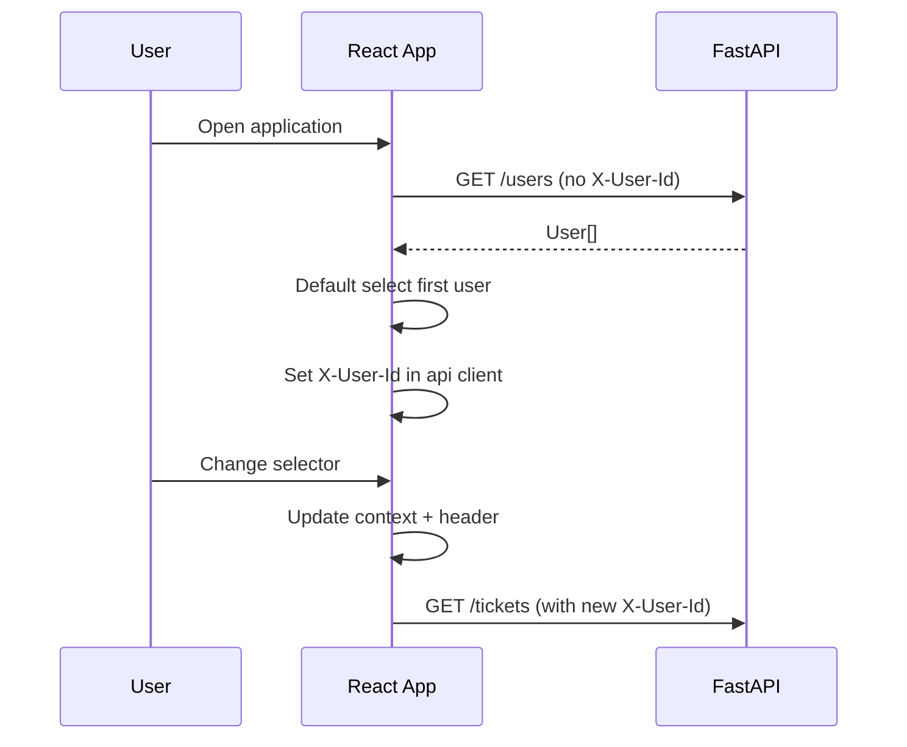
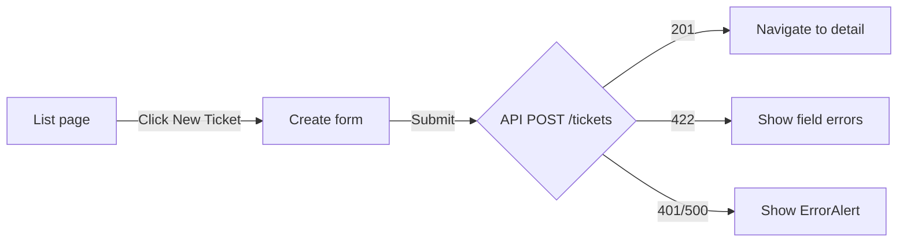
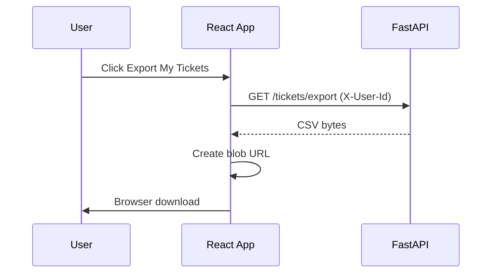

# UI Flow

**Version:** 1.0  
**Last Updated:** 2026-07-20  
**Status:** Design complete — ready for M5 implementation

---

## 1. Application Shell

```
┌────────────────────────────────────────────────────────────────┐
│  Support Ticket Management          Acting as: [▼ Alice Agent] │
│  Demo mode — X-User-Id header simulates current user, not auth │
├────────────────────────────────────────────────────────────────┤
│  Tickets   New Ticket   Export My Tickets                      │
├────────────────────────────────────────────────────────────────┤
│                                                                │
│                     <Route outlet / page>                      │
│                                                                │
└────────────────────────────────────────────────────────────────┘
```

### Global elements

| Element | Component | Behavior |
|---------|-----------|----------|
| Acting-user selector | `ActingUserSelector` | Loads `GET /users`; stores selection in context |
| Disclaimer banner | `AppHeader` | Always visible; explains non-auth context |
| Export button | `TicketExportButton` | Visible on list page and header; triggers CSV download |
| Error region | `ErrorAlert` | Page-level API errors |
| Loading | `LoadingSpinner` | Shown while fetching |

---

## 2. Routes and Pages

| Path | Page | Components |
|------|------|------------|
| `/` | `TicketListPage` | `TicketFilters`, `TicketList`, `TicketExportButton` |
| `/tickets/new` | `TicketCreatePage` | `TicketForm` (create mode) |
| `/tickets/:id` | `TicketDetailPage` | `TicketForm` (edit mode), `TicketStatusActions`, `CommentList`, `CommentForm` |

Router: `react-router-dom` v6.

---

## 3. Flow: Bootstrap and Acting User



**Steps:**

1. App mounts → fetch users (no header required).
2. Default to first user in list (or last selection from `sessionStorage` — optional Stretch).
3. Display: `Acting as: Alice Agent`.
4. On change → update `ActingUserContext` → all subsequent requests use new `X-User-Id`.
5. Re-fetch ticket list if on list page.

**Disclaimer copy:**

> Demo mode: the selected user is sent as `X-User-Id` for acting-user context. This is not authentication.

---

## 4. Flow: Create Ticket



**Form fields:**

| Field | Input type | Notes |
|-------|------------|-------|
| Title | text | Required, max 200 |
| Description | textarea | Required, max 5000 |
| Priority | select | Low, Medium, High, Critical |
| Assignee | select | Optional; populated from users list |

**On success:** Navigate to `/tickets/{id}`.

**On validation error:** Map `error.details.fields` to inline `<FieldError>` components.

---

## 5. Flow: List, Search, and Filter

```
┌─────────────────────────────────────────────────────────┐
│ Search: [____________]  Status: [All ▼]  Priority: [▼] │
│ Assignee: [All ▼]  [ ] Unassigned only    [Apply]      │
├─────────────────────────────────────────────────────────┤
│ Title          │ Status      │ Priority │ Assignee │ Upd │
│────────────────┼─────────────┼──────────┼──────────┼─────│
│ Login issue    │ Open        │ High     │ Bob      │ ... │
│ Printer offline│ In Progress │ Low      │ —        │ ... │
└─────────────────────────────────────────────────────────┘
```

**API mapping:**

| UI control | Query param |
|------------|-------------|
| Search box | `q` |
| Status dropdown | `status` (omit if "All") |
| Priority dropdown | `priority` |
| Assignee dropdown | `assignedTo` |
| Unassigned checkbox | `unassigned=true` |

**Behavior:**

- Filters applied on "Apply" or debounced search (300ms) — implementer's choice; recommend Apply for simplicity.
- Click row → navigate to `/tickets/{id}`.
- Empty state: "No tickets match your filters."
- Loading skeleton while fetching.

---

## 6. Flow: Ticket Detail

### Layout

```
┌─────────────────────────────────────────────────────────┐
│ ← Back to list                                          │
├─────────────────────────────────────────────────────────┤
│ Title: [editable]                                       │
│ Description: [editable textarea]                        │
│ Priority: [select]   Assignee: [select]   [Save Changes]│
├─────────────────────────────────────────────────────────┤
│ Status: Open                                            │
│ [Move to In Progress]  [Cancel Ticket]   ← allowed only  │
├─────────────────────────────────────────────────────────┤
│ Comments                                                │
│ ┌─────────────────────────────────────────────────────┐ │
│ │ Bob Admin — 2026-07-20 11:00                        │ │
│ │ Investigating the issue.                            │ │
│ └─────────────────────────────────────────────────────┘ │
│ [Add comment textarea]  [Post Comment]                  │
└─────────────────────────────────────────────────────────┘
```

### Load

1. `GET /tickets/{id}` → populate form + comments + `allowedStatusTransitions`.
2. Show read-only: `createdBy`, `createdAt`, `updatedAt`, `status`.

### Edit fields

1. User modifies title/description/priority/assignee.
2. Click "Save Changes" → `PATCH /tickets/{id}`.
3. On success: refresh local state from response.
4. On error: field errors or alert.

**Important:** Status is **not** in the edit form. Status changes use separate action buttons.

### Status actions

1. Render one button per item in `allowedStatusTransitions`.
2. Click → confirm dialog (optional) → `PATCH /tickets/{id}/status`.
3. On `INVALID_STATUS_TRANSITION`: show `error.message` in alert (should not happen if buttons match API).
4. On success: update status badge and refresh allowed buttons.

### Comments

1. `CommentList` renders `comments` from detail response.
2. `CommentForm` → `POST /tickets/{id}/comments`.
3. On success: append comment to list (or re-fetch detail).

---

## 7. Flow: CSV Export



**Scope message near button:**

> Exports tickets you created (not tickets assigned to you).

**Error handling:**

- 401 → prompt user to select a valid acting user.
- Network error → `ErrorAlert`.

---

## 8. Error States

| Situation | HTTP | UI response |
|-----------|------|-------------|
| Network offline | — | Banner: "Unable to reach server. Check your connection." |
| Missing acting user | 401 | Alert: "Please select a user to continue." |
| Validation error | 422 | Inline field errors from `error.details.fields` |
| Ticket not found | 404 | Full-page message + link to list |
| Invalid status transition | 422 | Alert with `error.message` |
| Server error | 500 | Alert: "Something went wrong. Please try again." |

### ErrorAlert component contract

```tsx
// Displays error.message; optionally lists details.fields
<ErrorAlert error={apiError} onDismiss={() => ...} />
```

---

## 9. Loading States

| Page | Loading UX |
|------|------------|
| List | Table skeleton or spinner overlay |
| Detail | Full-page spinner until ticket loads |
| Create | Disable submit + spinner on button |
| Save / status / comment | Disable action button during request |

---

## 10. Component ↔ API Matrix

| Component | API calls |
|-----------|-----------|
| `ActingUserSelector` | `GET /users` |
| `TicketList` | `GET /tickets?...` |
| `TicketForm` (create) | `POST /tickets` |
| `TicketForm` (edit) | `PATCH /tickets/{id}` |
| `TicketStatusActions` | `PATCH /tickets/{id}/status` |
| `CommentForm` | `POST /tickets/{id}/comments` |
| `TicketDetailPage` | `GET /tickets/{id}` |
| `TicketExportButton` | `GET /tickets/export` |

---

## 11. Accessibility (Core minimum)

- Form inputs have associated `<label>` elements.
- Status action buttons have descriptive text (not color-only).
- Focus management after navigation to detail page.

---

## 12. Implementation Status

| Item | Status |
|------|--------|
| Pages and components | Not implemented (M5) |
| Scaffold placeholder | `App.tsx` only |
