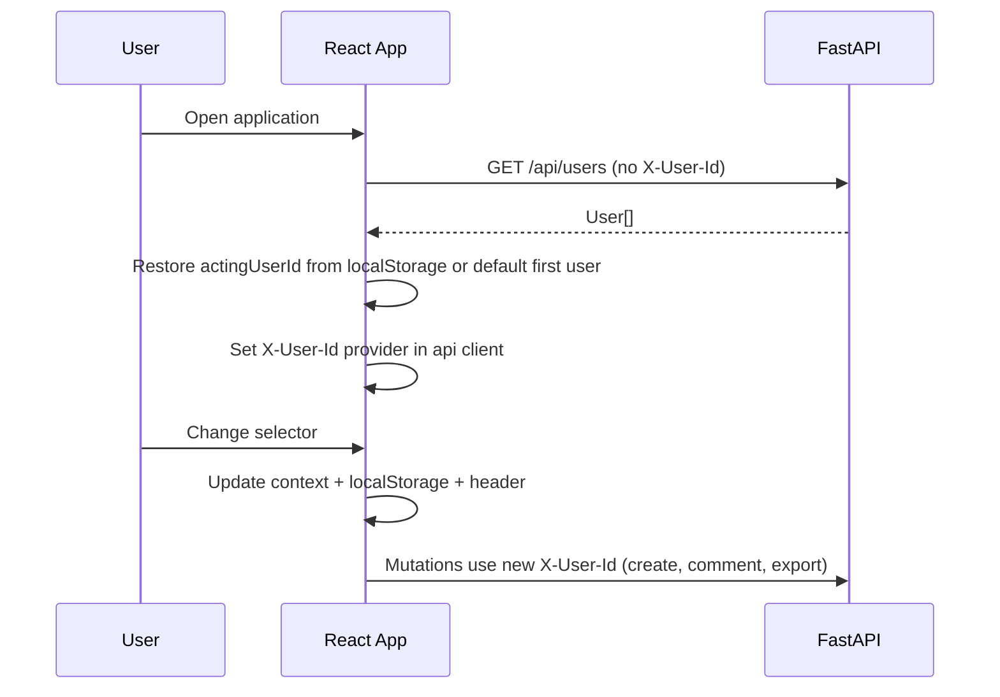
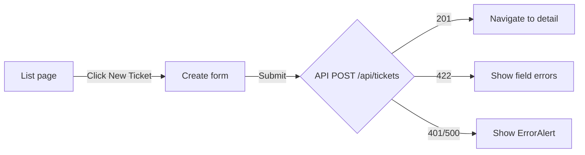
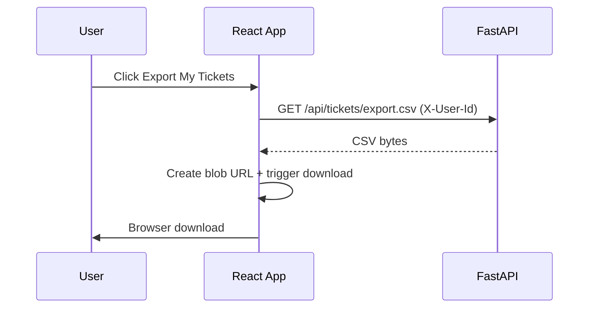

# UI Flow

**Version:** 1.1  
**Last Updated:** 2026-07-22  
**Status:** Implemented (M5 Core frontend)

---

## 1. Application Shell

```
┌────────────────────────────────────────────────────────────────┐
│  Support Ticket Management          Acting as: [▼ Alice Agent] │
│  Demo mode — X-User-Id header simulates current user, not auth │
├────────────────────────────────────────────────────────────────┤
│  Tickets   New Ticket   Export My Tickets                      │
├────────────────────────────────────────────────────────────────┤
│                                                                │
│                     <Route outlet / page>                      │
│                                                                │
└────────────────────────────────────────────────────────────────┘
```

### Global elements

| Element | Component | Behavior |
|---------|-----------|----------|
| Acting-user selector | `ActingUserSelector` | Loads `GET /api/users`; stores selection in `localStorage` (`actingUserId`) |
| Disclaimer banner | `AppLayout` | Always visible; explains non-auth context |
| Export button | `TicketExportButton` | On list page; triggers CSV download for acting user |
| Error region | `ErrorAlert` | Page-level API errors |
| Loading | `LoadingSpinner` | Shown while fetching |

---

## 2. Routes and Pages

| Path | Page | Components |
|------|------|------------|
| `/` | `TicketListPage` | `TicketFilters`, `TicketList`, `TicketExportButton` |
| `/tickets/new` | `TicketCreatePage` | `TicketForm` (create mode) |
| `/tickets/:id` | `TicketDetailPage` | `TicketForm` (edit mode), `TicketStatusActions`, `CommentList`, `CommentForm` |

Router: `react-router-dom` v6 (`BrowserRouter` in `App.tsx`).

---

## 3. Flow: Bootstrap and Acting User



**Steps:**

1. App mounts → `ActingUserProvider` fetches users (no header required).
2. Restore last selection from `localStorage` key `actingUserId`, or default to first user.
3. Display: `Acting as: Alice Agent` with disclaimer.
4. On change → update context, `localStorage`, and `X-User-Id` on subsequent acting-user requests.
5. Ticket list refetches when filters change (not on every user switch — list endpoint does not require header).

**Disclaimer copy (implemented):**

> Demo mode: the selected user is sent as `X-User-Id` for acting-user context. This is not authentication.

---

## 4. Flow: Create Ticket



**Form fields:**

| Field | Input type | Notes |
|-------|------------|-------|
| Title | text | Required, max 200 |
| Description | textarea | Required, max 5000 |
| Priority | select | Low, Medium, High, Critical |
| Assignee | select | Optional; populated from users list |

**On success:** Navigate to `/tickets/{id}`.

**On validation error:** Map `error.details.fields` to inline field errors via `mapApiErrorToFields`.

**Submit guard:** Button disabled while request runs; duplicate submissions prevented.

---

## 5. Flow: List, Search, and Filter

```
┌─────────────────────────────────────────────────────────┐
│ Search: [____________]  Status: [All ▼]  Priority: [▼] │
│ Assignee: [All ▼]  [ ] Unassigned only    [Apply]      │
├─────────────────────────────────────────────────────────┤
│ Title          │ Status      │ Priority │ Assignee │ Upd │
│────────────────┼─────────────┼──────────┼──────────┼─────│
│ Login issue    │ Open        │ High     │ Bob      │ ... │
│ Printer offline│ In Progress │ Low      │ —        │ ... │
└─────────────────────────────────────────────────────────┘
```

**API mapping:**

| UI control | Query param |
|------------|-------------|
| Search box | `q` |
| Status dropdown | `status` (omit if "All") |
| Priority dropdown | `priority` |
| Assignee dropdown | `assignedTo` |
| Unassigned checkbox | `unassigned=true` |

**Behavior:**

- Filters applied on "Apply" button click.
- Click row → navigate to `/tickets/{id}`.
- Empty state: `EmptyState` when no tickets match.
- Loading spinner while fetching.
- After creating a ticket (navigate back to list), list reloads on mount.

---

## 6. Flow: Ticket Detail

### Layout

```
┌─────────────────────────────────────────────────────────┐
│ ← Back to list                                          │
├─────────────────────────────────────────────────────────┤
│ Status badge │ Creator │ Assignee │ Created │ Updated   │
├─────────────────────────────────────────────────────────┤
│ Title: [editable]                                       │
│ Description: [editable textarea]                        │
│ Priority: [select]   Assignee: [select]   [Save Changes]│
├─────────────────────────────────────────────────────────┤
│ Status: Open                                            │
│ [Move to In Progress]  [Move to Cancelled]              │
├─────────────────────────────────────────────────────────┤
│ Comments                                                │
│ ┌─────────────────────────────────────────────────────┐ │
│ │ Bob Admin — 2026-07-20 11:00                        │ │
│ │ Investigating the issue.                            │ │
│ └─────────────────────────────────────────────────────┘ │
│ [Add comment textarea]  [Post Comment]                  │
└─────────────────────────────────────────────────────────┘
```

### Load

1. `GET /api/tickets/{id}` → populate form + comments + `allowedStatusTransitions`.
2. Show read-only meta: `creator`, `assignee`, `createdAt`, `updatedAt`, `status` badge.
3. 404 → `NotFoundState`.

### Edit fields

1. User modifies title/description/priority/assignee.
2. Click "Save changes" → `PATCH /api/tickets/{id}`.
3. On success: re-fetch detail; show success banner.
4. On error: field errors or `ErrorAlert`.

**Important:** Status is **not** in the edit form. Status changes use `TicketStatusActions` buttons only.

### Status actions

Status buttons are driven by `allowedStatusTransitions` from the API (backend is source of truth):

| Current status | Allowed transitions |
|----------------|---------------------|
| Open | In Progress, Cancelled |
| In Progress | Resolved, Cancelled |
| Resolved | Closed |
| Closed | *(none)* |
| Cancelled | *(none)* |

1. Render one button per item in `allowedStatusTransitions`.
2. Click → `PATCH /api/tickets/{id}/status` with `{ status }`.
3. On `INVALID_STATUS_TRANSITION` (HTTP 409): show `error.message` in status alert; **revert** local status to previous value.
4. On success: re-fetch detail; show success banner.

### Comments

1. `CommentList` renders `comments` from detail response.
2. `CommentForm` → `POST /api/tickets/{id}/comments` with `X-User-Id`.
3. On success: re-fetch detail; show success banner.

---

## 7. Flow: CSV Export



**Scope message near button:**

> Exports tickets you created (not tickets assigned to you).

**Error handling:**

- 401 → prompt user to select a valid acting user.
- Network error → `ErrorAlert`.

---

## 8. Error States

| Situation | HTTP | UI response |
|-----------|------|-------------|
| Network offline | — | `NetworkError` message in `ErrorAlert` |
| Missing acting user | 401 | Alert: "Please select a user to continue." |
| Validation error | 422 | Inline field errors from `error.details.fields` |
| Ticket not found | 404 | `NotFoundState` + link to list |
| Invalid status transition | **409** | Status alert with `error.message`; status unchanged |
| Server error | 500 | Alert with backend `error.message` |

### ErrorAlert component contract

```tsx
<ErrorAlert error={apiError} onDismiss={() => ...} />
```

---

## 9. Loading States

| Page | Loading UX |
|------|------------|
| List | `LoadingSpinner` overlay |
| Detail | Full-page spinner until ticket loads |
| Create | Disable submit + "Creating…" on button |
| Save / status / comment | Disable action button during request |

---

## 10. Component ↔ API Matrix

| Component | API calls |
|-----------|-----------|
| `ActingUserSelector` | `GET /api/users` |
| `TicketList` | `GET /api/tickets?...` |
| `TicketForm` (create) | `POST /api/tickets` (+ `X-User-Id`) |
| `TicketForm` (edit) | `PATCH /api/tickets/{id}` |
| `TicketStatusActions` | `PATCH /api/tickets/{id}/status` |
| `CommentForm` | `POST /api/tickets/{id}/comments` (+ `X-User-Id`) |
| `TicketDetailPage` | `GET /api/tickets/{id}` |
| `TicketExportButton` | `GET /api/tickets/export.csv` (+ `X-User-Id`) |

---

## 11. Accessibility (Core minimum)

- Form inputs have associated `<label>` elements (`htmlFor` / `id`).
- Status action buttons have descriptive text ("Move to In Progress").
- `role="alert"` on error messages; `role="status"` on success banners.

---

## 12. Implementation Status

| Item | Status |
|------|--------|
| `AppLayout` + `ActingUserSelector` | **Done** |
| `TicketListPage` + filters + export | **Done** |
| `TicketCreatePage` | **Done** |
| `TicketDetailPage` + status + comments | **Done** |
| Common states (loading, empty, error, not-found) | **Done** |
| Frontend tests (Vitest + RTL) | **20 passing** |
| Production build | **Passing** |

**Source layout:** `src/frontend/src/`
